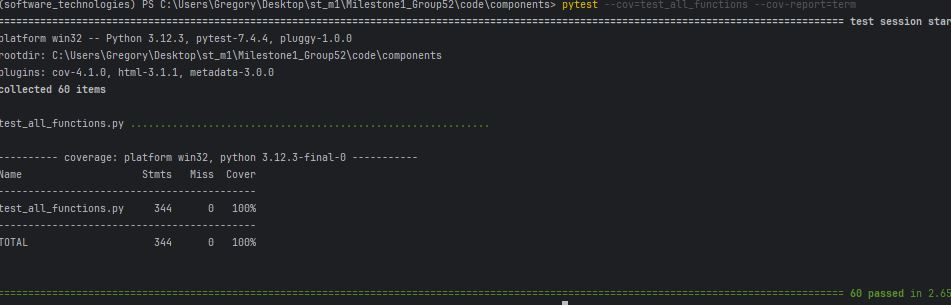
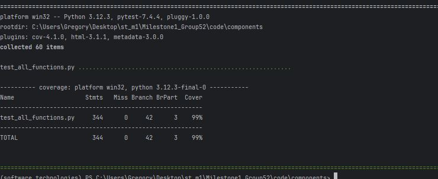

# Coverage Testing Report

### GitHub Repository URL: https://github.com/Altidias/Milestone1_Group52

---

## 1. **Test Summary**

| **Tested Functions** |
|----------------------|
| `SearchHandler.search_food()` |
| `SearchHandler.filter_by_range()` |
| `SearchHandler.filter_by_level()` |
| `SearchHandler.get_food_item()` |
| `DataHandler.load_database()` |
| `DataHandler.update_daily_intake()` |
| `DataHandler.set_daily_goal()` |
| `DataHandler.get_database()` |
| `DataHandler.get_user_data()` |
| `DataHandler.get_goals_for_date()` |
| `DataHandler.get_intake_for_date()` |
| `DataHandler.reset_user_data()` |
| `TrackerHandler.set_daily_goal()` |
| `TrackerHandler.log_food_intake()` |
| `TrackerHandler.check_goal_progress()` |
| `TrackerHandler.overall_progress()` |
| `TrackerHandler.get_daily_intake()` |
| `TrackerHandler.get_goal()` |

---

## 2. **Statement Coverage Test**

### 2.1 Description

To get high statement coverage, the test cases were implemented `test_all_functions.py` with these considerations:

1. **Full Coverage**: At least one test case was made for each function.

2. **Different Scenarios**: For certain functions, we designed different test cases to cover the variable execution paths.

3. **Edge Cases**: We included tests for the edge cases and the boundary conditions. 

4. **Exception Handling**: Tests made to trigger and verify exception handling in code.

5. **Empty and Invalid Inputs**: Tests we designed to cover cases where inputs might be empty or invalid.

We aimed to execute every statement in our code at least once, helping achieve high statement coverage and find any untested parts of our project.

### 2.2 Testing Results

## 3. **Branch Coverage Test**

### 3.1 Description

To achieve high branch coverage, we designed our test cases in `test_all_functions.py` with the following strategies:

1. **Conditional Statement Testing**: Test cases were made that have both true and false conditions for each if/else statement in our code.

2. **Exception Handling Coverage**: Tests were made that trigger exception handling code.

3. **Boundary Conditions**: We designed tests that cover the boundary conditions of our functions.

4. **Empty and Null Input Testing**: We made tests to cover branches that handle empty or null inputs:

5. **Loop Coverage**: For functions containing loops, we implemented tests to cover cases where the loop is executed zero, once, and multiple times.

6. **Mutually Exclusive Conditions**: For functions have mutually exclusive conditions, we created tests for each condition.

We tested every possible branch in our code, allowing high branch coverage and ensuring all decisions in our application are thoroughly tested.

### 3.2 Testing Results
*Note: the partial branch coverage num 3 is due to the fact that pytest is counting the helper functions for deleting temp files in the test file for some reason.*

