# Executive Summary

Please provide your GitHub repository link.
### GitHub Repository URL: https://github.com/Altidias/Milestone1_Group52

---

You should use your software to prepare an executive summary as outlined below for the five required features.

## 1. Food Search
### Description  
Handles searching the database for food item's and their corresponding nutritional information, allows for similarity based searching, which enables suggestions in the gui.

### Steps
1. The user inputs a food item or parital match into the search bar, the program then displays a list of suggested food items that are similar to the query.
2. The user can select a suggested item, then the search bar will display the selected item.
3. The user can click the search icon or press enter, then they will be redirected to a frame with the results.

### Screenshots
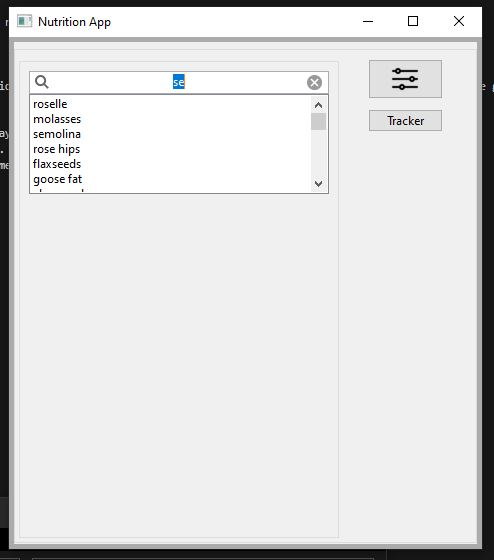

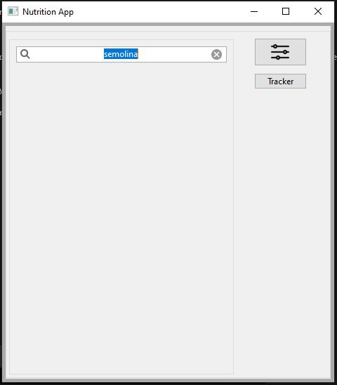

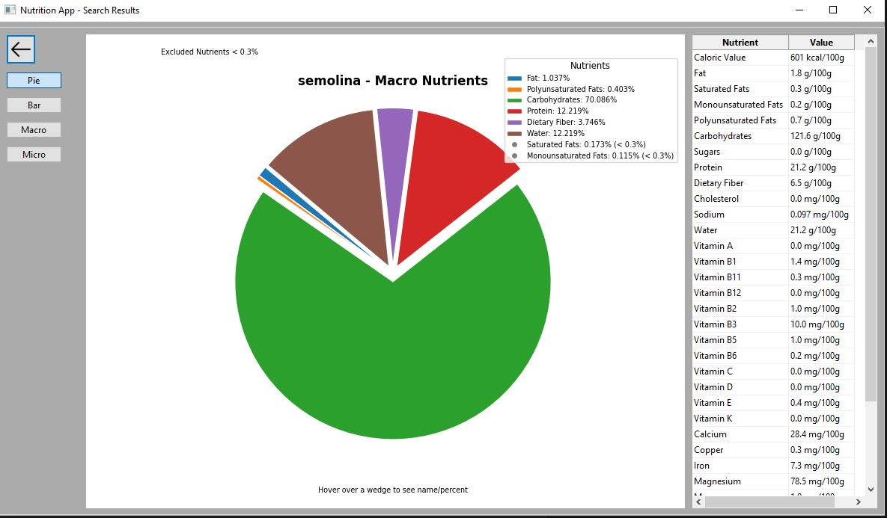

---

## 2. Nutrient Breakdown and Visualization
### Description  
This feature allows for the visual and textual inspection of a selected food item's nutritional content. Viewable through a pie or bie chart and a table, the graph visualization allows the macro and micronutrients to be viewed seperately.
the pie chart leaves out nutrients below a certain threshold to enhance readability.

### Steps
1. The user must first search for a food item to go to the results page.
2. Select the pie or bar chart button to switch between the two visualization modes.
3. Select the macro or micronutrient button to switch between the two nutritional breakdown modes.
4. Use the cursor to hover over the chart to see the exact values of each nutrient.

### Screenshots
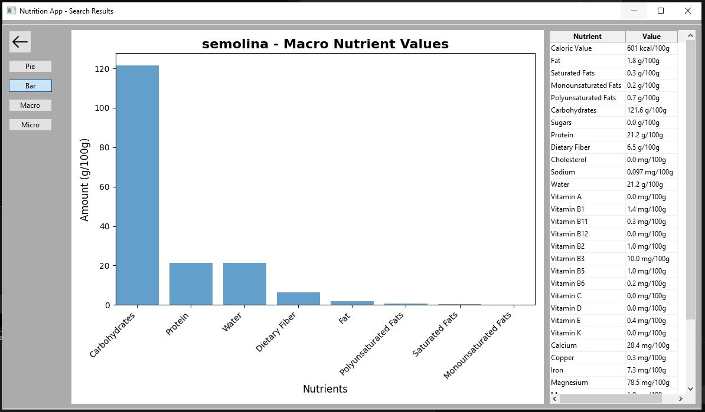

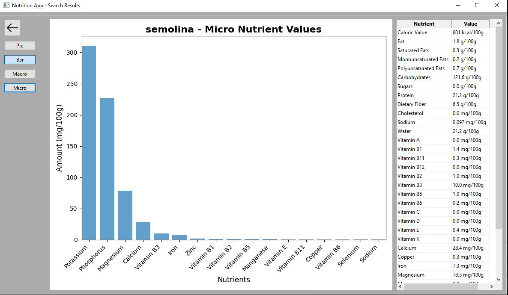

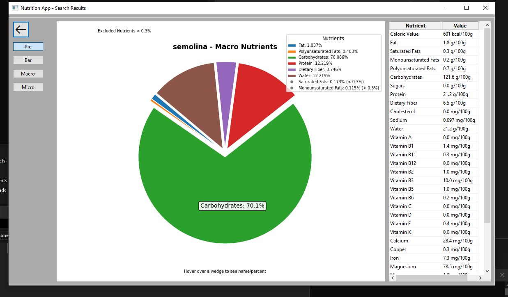

---

## 3. Nutrition Range Filter
### Description  
Allows the user to define a minimum and maximum value for a selected nutrient, and then filters the results to only show food items that have a nutrient value within the specified range with a table.

### Steps
1. Enable the filter button on the main page.
2. Select the nutrient you wish to filter by and enable the range option.
3. Enter a minimum and maximum value for the selected nutrient.
4. Click the apply button and view the results.

### Screenshots  
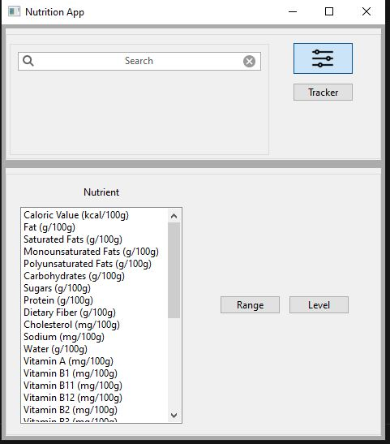

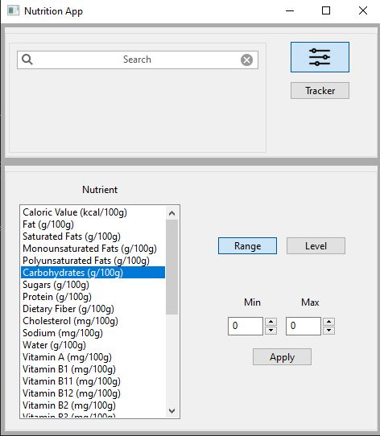

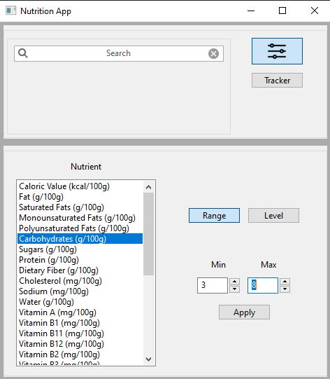

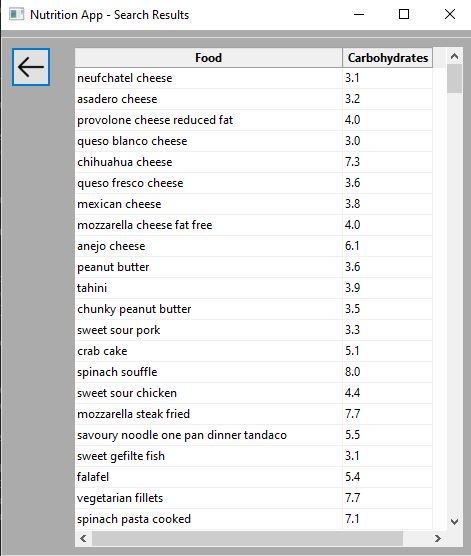
---

## 4. Nutrition Level Filter
### Description  
This feature allows the user to filter the food items by the level of a selected nutrient. The levels low, mid and high are derived from the highest value for each nutrient in the dataset.

### Steps
1. Enable the filter button on the main page.
2. Select the nutrient you wish to filter by and enable the level option.
3. Select the level you wish to filter by.
4. Click the apply button and view the results.

### Screenshots
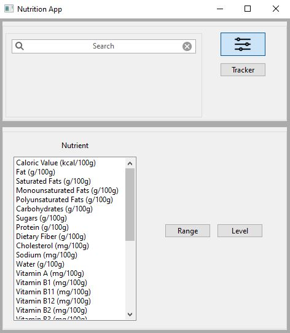

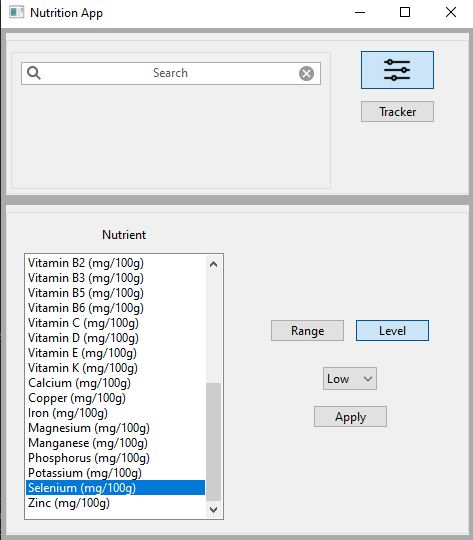

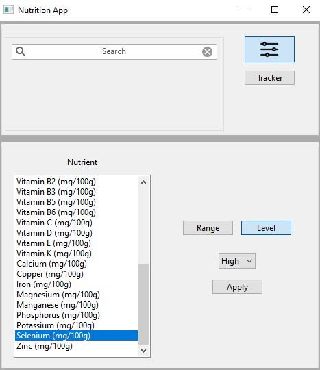

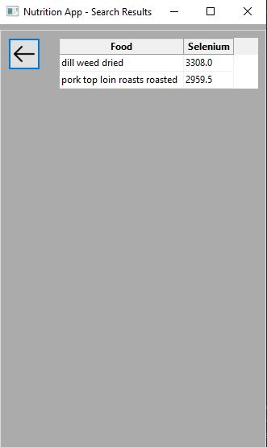
---

## 5. Goal and Progress Tracking
### Description  
This feature allows the user to track their progress towards their goal. The user can set different goals for different nutrients, they can input food items into the tracker and the servings, the tracker
will save this data and add it to the daily total. The user can also view their progress over time.

### Steps
1. Click the tracker button in the main page to access the tracker page.
2. Select a nutrient and set a goal for it, then click update to save it.
3. To track intake enter a food item into the search bar and input the servings, then click update to save it.
4. To view progress click the Generate Report button which will generate and save a pdf of the users progress and open it after generating.

### Screenshots
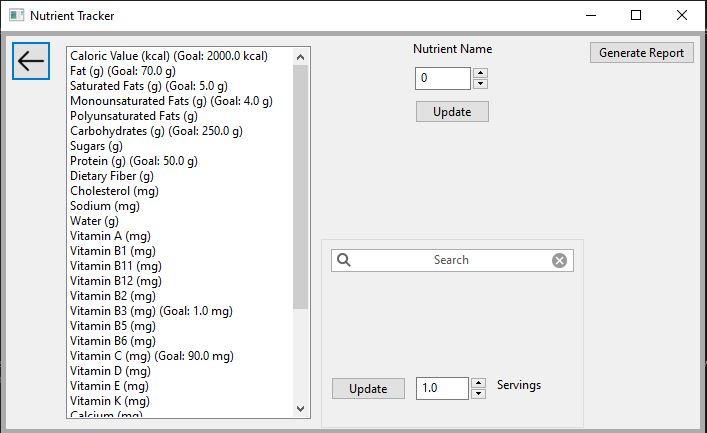

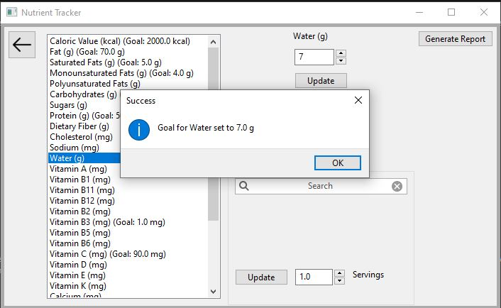

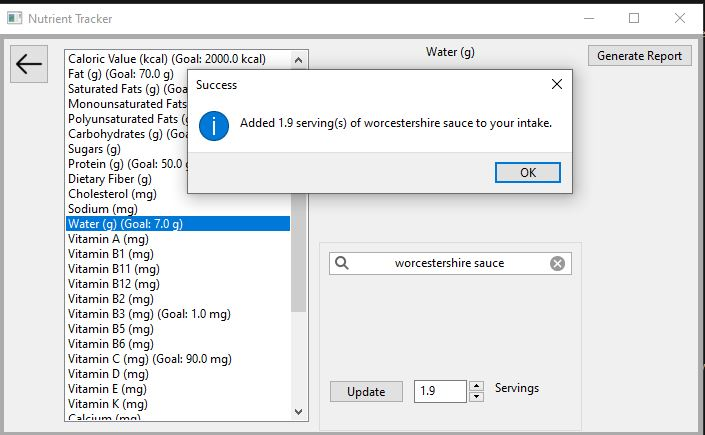

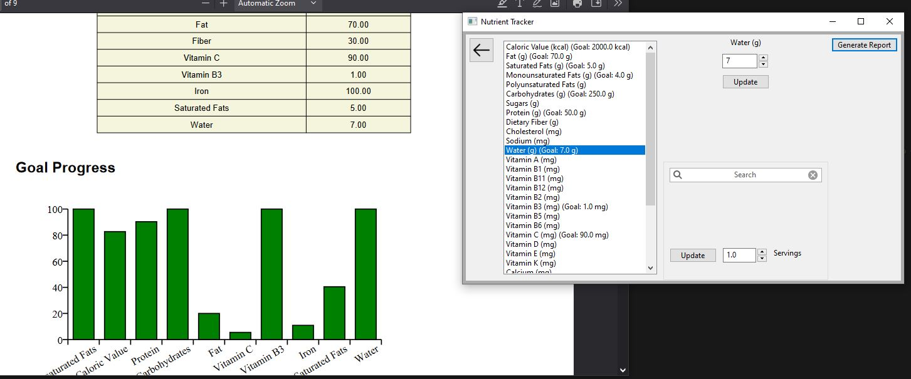

---
