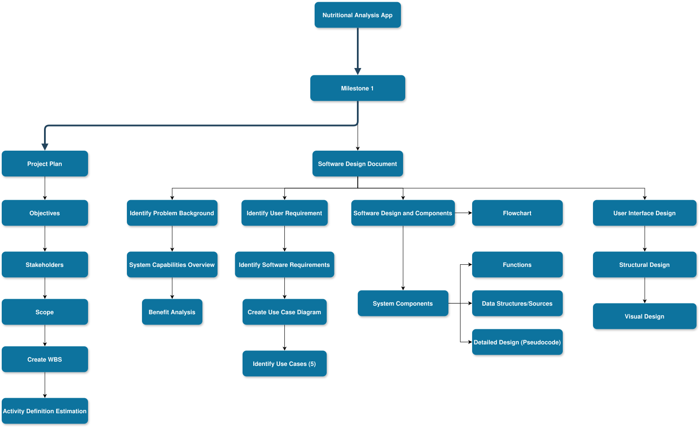

# Project Plan

## Project Name: Nutrition App Development
## Group Number: 52

### Team members

| Student No. | Full Name     | GitHub Username | Contribution (sum to 100%) | 
|-------------|---------------|-----------------|----------------------------|
| s5278113    | Jacob Barany  | Altidias        | 33.3% or Equal             |
| s5345670    | Glyza Lou Sim | Glyza-Lou       | 33.3% or Equal             | 
| s5357200     | Chathumika Dimukthi Wijesinghe     | Chathumika             | 33.3% or Equal             | 

### Brief Description of Contribution

Please Describe what you have accomplished in this group project.
- s5278113, Jacob Barany
  - Accomplishments: Describe what you have completed or achieved
- s5345670, Glyza Lou Sim
  - Accomplishments: Describe what you have completed or achieved
- s5357200, Chathumika Dimukthi Wijesinghe
  - Accomplishments: Describe what you have completed or achieved

# Table of Contents

* [Project Plan](#project-plan)
  * [1. Project Overview](#1-project-overview)
    * [1.1 Project Objectives](#11-project-objectives)
    * [1.2 Project Stakeholders](#12-project-stakeholders)
    * [1.3 Project Scope](#13-project-scope)
  * [2. Work Breakdown Structure](#2-work-breakdown-structure)
  * [3. Activity Definition Estimation](#3-activity-definition-estimation)
  * [4. Gantt Chart](#4-gantt-chart)

## 1. Project Overview

### 1.1 Project Objectives

Create a user-friendly desktop application to allow for the searching, analysis, and visualization of various nutritional data from a comprehensive food database.

The application will include the following features:
- Search and view nutritional information by food name.
- Nutritional analysis with pie and bar charts for a comprehensive breakdown.
- Data filtering to filter specific foods by specific nutrition ranges.
- A daily nutrition tracker that allows users to keep track of their dietary intake and set goals.

### 1.2 Project Stakeholders

Identify all key stakeholders involved in the project, including internal teams and potential end-users.

Internal stakeholders
- Project managers – they have a strong influence on how successful the application is based on how well they have allocated tasks, organized workflow, communicate deadlines and ensuring the final product meets the scope.
- Developers – they are directly involved with how smoothly the application runs as developers are responsible for bringing the app to life. They work closely with the project manager to maintain app functionality, flexibility, reliability and to deliver quality code. Maintenance, security and frequent updates are some of the other things developers have an influence on in relation to the app.
- Designers – they are directly responsible for the user interface (UI) and user experience (UX) of the app. Everything down to layout, colour palette, reading flow and visuals are examples of elements that greatly influence how good consumer retention rates are. The app must also be user-friendly and engaging to encourage frequent use from the target audience in their tracking habits.

External stakeholders
- Consumers  – This includes the public who are casual users looking to track their nutrients. It provides them the basic tools needed to aid healthier decision-making as well as provide visual feedback on their intake.
- Researchers – This app could be of interest to researchers that want a deeper analysis of nutritional habits form a large audience. By safely and securely utilizing the apps collected data, researchers benefit by having valuable insight to trends amongst users.
- Government Bodies – They are responsible for monitoring the app to make sure it does not violate privacy laws and complies with health regulations. An example would be the FDA, they would ensure the app does not provide inaccurate or outdated nutrition information. 
- Investors – They are one of the most influential stakeholder groups. The funding would help launch, advertise and expand the app to increase popularity as a return on investment. Their contribution will allow the app to stay competitive in the industry and meet the users needs.
- Personal Trainers – Through this app, personal trainers are able to track their clients progress in real time and provide suitable workout routines and advice tailored to the client’s fitness goals. 

### 1.3 Project Scope

Product scope statement
 - The goal of this project is to develop a desktop application for searching, visualizing and analyzing nutritional data from a large food database. The app will give users a platform to efficiently access nutritional information, nutritional breakdowns, search for foods based on a nutritional criteria and track their daily dietary intake/goals.

Project deliverables
 - A user interface that enables food search and displays nutritional information.
 - Visualization tools such as pie charts and bar graphs for breakdown analysis.
 - Functionality to filter foods by their nutritional content/ranges.
 - A daily nutrition tracker feature to monitor dietary intake and goals.
 - Documentation for application usage.
 
Product acceptance criteria
 - All functional requirements must be met, program should function as intended with all the intended features
 - The user interface should be intuitive and simple so that anyone can use it.
 - Comprehensive test planning and test case development - Unit testing, integration testing, system testing, user acceptance testing -> Bug tracking and fixing
 - Performance and security monitoring

Exclusions
 - Further support/maintenance after project is complete
 - Integration with third party databases or apps.

## 2. Work Breakdown Structure

## 3. Activity Definition Estimation

| Activity #No | Activity Name                         | Brief Description                                                                                                                                                                           | Duration | Assigned Team Members |
|--------------|---------------------------------------|---------------------------------------------------------------------------------------------------------------------------------------------------------------------------------------------|----------|-----------------------|
| 2            | Develop Project Plan                  | Plan out all activities to be completed for this project.                                                                                                                                   | TBD      |                       |
| 2.1          | Define Project Objectives             | Identify and document the key objectives for the project.                                                                                                                                   | TBD      |                       |
| 2.2          | Identify Project Stakeholders         | List all necessary stakeholders involved in the project.                                                                                                                                    | TBD      |                       |
| 2.3          | Define Project Scope                  | Clearly outline scope of the project.                                                                                                                                                       | TBD      |                       |
| 2.4          | Develop WBS                           | Create a structured hierarchy of tasks to complete the project.                                                                                                                             | TBD      |                       |
| 2.5          | Activity Definition Estimate          | Estimate the duration and assigned members for each project task.                                                                                                                           | TBD      |                       |
| 2.6          | Gantt Chart Preparation               | Produce a Gantt chart to visualize the project timeline for tasks.                                                                                                                          | TBD      |                       |
| 2.7          | Develop Software Design Document      | Prepare a document that outlines the architecture and design of the application.                                                                                                            | TBD      |                       |
| 2.7.1        | System Vision                         | Define the vision of the system and its requirements/goals.                                                                                                                                 | TBD      |                       |
| 2.7.1.1      | Problem Background                    | Identify the background of the problem being solved.                                                                                                                                        | TBD      |                       |
| 2.7.1.2      | System Capabilities Overview          | Identify the capability and features of the system being developed.                                                                                                                         | TBD      |                       |
| 2.7.1.3      | Benefit Analysis                      | Analyze and identify the benefits provided from the development of this application.                                                                                                        | TBD      |                       |
| 2.7.2        | Requirements                          | Define user and software requirements.                                                                                                                                                      | TBD      |                       |
| 2.7.2.1      | User Requirements                     | Detail how users are expected to interact with or use the program (create a fictional user).                                                                                                | TBD      |                       |
| 2.7.2.2      | Software Requirements                 | Define the functionality which the application will provide.                                                                                                                                | TBD      |                       |
| 2.7.2.3      | Use Case Diagram                      | Provide a system-level Use Case Diagram illustrating all required features.                                                                                                                 | TBD      |                       |
| 2.7.2.4      | Use Cases                             | Develop detailed descriptions of each use case, at least 5 use cases, each corresponding to specific functions.                                                                             | TBD      |                       |
| 2.7.3        | Software Design and System Components | Document the software design and the components that will make up the system.                                                                                                               | TBD      |                       |
| 2.7.3.1      | Software Design                       | Make flowchart that illustrates how the software will operate.                                                                                                                              | TBD      |                       |
| 2.7.3.2      | System Components                     | List components and their roles within the system.                                                                                                                                          | TBD      |                       |
| 2.7.3.2.1    | Functions                             | List all key functions within the software, for each define the description, input parameters, return value and side effects.                                                               | TBD      |                       |
| 2.7.3.2.2    | Data Structures / Data Sources        | List all data structures or sources used in the software, for each provide type, usage and functions.                                                                                       | TBD      |                       |
| 2.7.3.2.3    | Detailed Design                       | Provide pseudocode or flowcharts for all functions listed in 2.7.3.2.1.                                                                                                                     | TBD      |                       |
| 2.7.4        | UI Design                             | Design the user interface for the application.                                                                                                                                              | TBD      |                       |
| 2.7.4.1      | Structural Design                     | Present a structural design, a hierarchy chart, showing the overall interface's structure, address structure, information, navigation and design choices.                                   | TBD      |                       |
| 2.7.4.2      | Visual Design                         | Include all wireframes or mockups of the interface. Provide a discussion, explanation and justification for design choices, include interface components, screens/menus and design details. | TBD      |                       |
| 3.1          | Develop Software Components           | Build and implement software components for the application.                                                                                                                                | TBD      |                       |
| 3.2          | Integrate Software Components         | Combine all software components and ensure they work together.                                                                                                                              | TBD      |                       |
| 3.3          | Perform Initial Testing               | Conduct testing to identify any issues or bugs in the software before publishing.                                                                                                           | TBD      |                       |
| 4.1          | Status Reports                        | Regular updates on the projects and any issues encountered, git logs.                                                                                                                       | TBD      |                       |
| 4.2          | Update Plans                          | Change project plans based on progress or feedback.                                                                                                                                         | TBD      |                       |
| 5.1          | Final Performance Review              | Conduct a review of the final system based on the initial project objectives.                                                                                                               | TBD      |                       |
| 5.2          | Prepare Final Report                  | Compile a report summarizing the projects outcomes.                                                                                                                                         | TBD      |                       |

## 4. Gantt Chart

