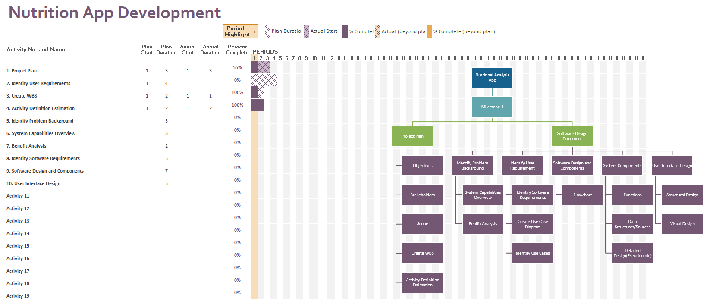

# Project Plan

## Project Name: XXXX
## Group Number: 001

### Team members

| Student No. | Full Name | GitHub Username | Contribution (sum to 100%) | 
|-------------|-----------|-----------------|----------------------------|
| s111111     | Full name | xxx             | 33.3% or Equal             |
| s222222     | Full name | xxx             | 33.3% or Equal             | 
| s333333     | Full name | xxx             | 33.3% or Equal             | 

### Brief Description of Contribution

Please Describe what you have accomplished in this group project.
- s2578113, Jacob Barany
  - Accomplishments: Describe what you have completed or achieved
- s222222, Full name
  - Accomplishments: Describe what you have completed or achieved
- s333333, full name
  - Accomplishments: Describe what you have completed or achieved

# Table of Contents

* [Project Plan](#project-plan)
  * [1. Project Overview](#1-project-overview)
    * [1.1 Project Objectives](#11-project-objectives)
    * [1.2 Project Stakeholders](#12-project-stakeholders)
    * [1.3 Project Scope](#13-project-scope)
  * [2. Work Breakdown Structure](#2-work-breakdown-structure)
  * [3. Activity Definition Estimation](#3-activity-definition-estimation)
  * [4. Gantt Chart](#4-gantt-chart)

## 1. Project Overview

### 1.1 Project Objectives

- Make an application to browse a nutrional database

### 1.2 Project Stakeholders

Identify all key stakeholders involved in the project, including internal teams and potential end-users.

### 1.3 Project Scope

Product scope statement
 - Design a desktop application to search and analyse different food's nutritional content

Project deliverables
 - Create a user interface that allows food search and nutritional breakdown visualisation using pie and bar charts, and data filtering by nutritional range and content levels.
 - Documentation and reporting
 - Develop additional feature to visualise the dataset creatively - Implement a daily nutrion tracker
 
Product acceptance criteria
 - Comprehensive test planning and test case development - Unit testing, integration testing, system testing, user acceptance testing -> Bug tracking and fixing
 - Performance and security monitoring 

Exclusions
 - Further support after project is complete

## 2. Work Breakdown Structure

Include the Work Breakdown Structure (WBS) for the entire project. WBS should be presented as a hierarchical diagram. Use the elements from the WBS to define activities in Section 3, and schedule these activities in the Gantt Chart in Section 4. Ensure all project activities are considered and included in the WBS.

## 3. Activity Definition Estimation

Define the activities required for your project based on the WBS, and assign responsibilities to team members. Each activity should be numbered and correspond with your Gantt chart. Provide estimated durations for each activity to facilitate Gantt chart preparation.

| Activity #No | Activity Name | Brief Description | Duration | Responsible Team Members |
|--------------|---------------|-------------------|----------|--------------------------|
| xxx          | xxx           | xxx               | xxx      | xxx \& yyy               |
| xxxx         | xxx           | xxx               | xxx      | All                      |
| xxxx         | xxx           | xxx               | xxx      | xxx                      |

## 4. Gantt Chart
You have to use the provided Gantt chart template.  

Use the provided Gantt chart template to list all items from the Activity Definition along with relevant estimates 
and scheduling. Ensure that the Gantt chart reflects the activity definitions from Section 3. Track actual start 
times and durations. Besides including Gantt chart here, you should also submit your Gantt chart file separately.

