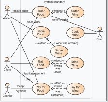
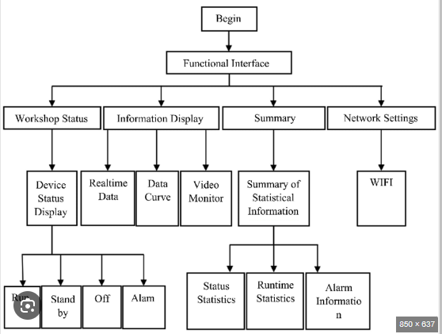
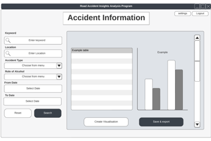

# Software Design Document

## Project Name: Nutrition App Development
## Group Number: 52

## Team members

| Student Number | Name                            | 
|----------------|---------------------------------|
| s5278113       | Jacob Barany                    |
| s5345670       | Glyza Lou Sim                   | 
| s5357200       | Chathumika Dimukthi Wijesinghe  | 

# Table of Contents

<!-- TOC -->
* [Table of Contents](#table-of-contents)
  * [1. System Vision](#1-system-vision)
    * [1.1 Problem Background](#11-problem-background)
    * [1.2 System capabilities/overview](#12-system-capabilitiesoverview)
    * [1.3	Potential Benefits](#13potential-benefits)
  * [2. Requirements](#2-requirements)
    * [2.1 User Requirements](#21-user-requirements)
    * [2.2	Software Requirements](#22software-requirements)
    * [2.3 Use Case Diagrams](#23-use-case-diagrams)
    * [2.4 Use Cases](#24-use-cases)
  * [3.	Software Design and System Components](#3-software-design-and-system-components-)
    * [3.1	Software Design](#31software-design)
    * [3.2	System Components](#32system-components)
      * [3.2.1 Functions](#321-functions)
      * [3.2.2 Data Structures / Data Sources](#322-data-structures--data-sources)
      * [3.2.3 Detailed Design](#323-detailed-design)
  * [4. User Interface Design](#4-user-interface-design)
    * [4.1 Structural Design](#41-structural-design)
    * [4.2	Visual Design](#42visual-design)
<!-- TOC -->

## 1. System Vision

### 1.1 Problem Background

- Problem Identification: This system is aimed at solving the problem of providing accessible and user-friendly access to food nutrition information. As more people become health conscious and aware of the impacts that a bad diet can have on their health, there is a growing demand for easily accessible and detailed information on the nutritional content of specific foods. Many people also lack a way to efficiently manage their daily intake on top of the above problem, which is specifically important for people with health complications or gym goers who tend to follow strict dietary rules, which this system aims to solve by providing an easy way to track daily caloric/nutritional intake.
- Dataset: The provided **Food_Nutrition_Dataset.csv** database will be used to retrieve food specific nutritional information.
- Data Input/Output: 
  - Data Input: 
    - **Food Search**: Users can input the name of a food item to search for its nutritional information.
    - **Data Filtering**: Users can set advanced filters to search for foods that meet specific nutritional ranges/levels.
    - **Nutrition Tracker**: Users can input their daily intake specifying the food items and quantity (weight or servings) 
    - **Goal Setting**: Users can input/set dietary goals for things such as caloric intake or specific nutritional requirements.
  - Data Output:
    - **Nutritional Information Display**: The UI will display detailed plain text nutritional information for the queried food item/s.
    - **Visual Analysis**: The UI will display pie and bar graphs to give users a better way to view the nutritional information.
    - **Filtered Food Lists**: The application will generate lists of food items based on the nutrition level input filters and display them in the UI.
    - **Progress Tracking**: The application will track the user's intake against their goal and provide feedback on their progress, the UI will display a progress graph on specific nutrients and calories, as well as some text based information.
- Target Users: 
  - Health conscious people
  - People with strict dietary requirements 
  - Gym goers / fitness enthusiasts
  - Personal trainers
  - Researchers 
  - Healthcare Professionals (e.g. dietitians and nutritionists).

### 1.2 System capabilities/overview

- System Functionality: What will the system do?
  - Provides visual representations based on user input
  - Display nutrition information based on user input
  - Tracks users’ nutrition intake and compares against set goals
  - Cater to a diverse range of users that may have dietary restrictions

- Features and Functionalities: Describe the key features and functionalities of the system.
  - User-friendly interface
  - Goal tracking
  - Daily nutrition tracking
  - Visual data representations

### 1.3	Benefit Analysis

How will this system provide value or benefit?
- Provides motivation for users who use the daily tracking system through the visual graphs and user-friendly UI
- Promotes healthy food habits to keep users on track for their goals
- By having an app that provides quick food search and advanced filtering it helps save time for researching purposes or for calculating personal intake
- Valuable for educational purposes since the app can be used by healthcare professionals and researchers 
- Providing detailed descriptions and numbers on what a food item contains can help users make informed decisions on what they consume 
- The app can cater to a wide variety of people who have health conditions and dietary restrictions which gives the app the competitive edge

## 2. Requirements

### 2.1 User Requirements

This application will provide a simple but powerful GUI for users to interact with the system. Designed for the average non-tech-savvy individual to ensure greater accessibility.

Fictional User: A gym goer who is focused on meeting specific dietary intakes to maintain a healthy diet. This user is fairly knowledgeable on nutrition but needs an easy tool to manage daily food intake, track progress and access nutritional information 

From the user's perspective the application will:
- Allow the searching of specific foods by name and viewing of detailed nutritional information in an easy-to-read format.
- Present nutritional data visually with pie and bar graphs which helps the user understand the nutritional breakdown of different foods.
- Enable advanced filtering/searching options to find foods based on specific nutritional criteria, allowing filtering by range or levels of specific nutrients.
- Provide a daily nutrition/intake tracker to log food intake, track nutritional consumption and monitor progress towards any set goals.
- Allow users to set and modify daily nutritional goals, showing progress from the tracker.

### 2.2	Software Requirements
Define the functionality the software will provide. This section should list requirements formally, often using the word "shall" to describe functionalities.

- R1.1 The program shall provide a search functionality for users to input text (food item name) and retrieve nutritional information from the database.
- R1.2 The program shall display nutritional data using pie and bar charts.
- R1.3 The program shall support data filtering.
  - R1.3.1 Nutritional range filtering, allowing users to specifcy a nutrient and define a min and max.
  - R1.3.2 Nutrition level filtering, categorizing foods into low, mid and high thresholds, based on the nutrient distribution in the entire database.
- R1.4 The program shall include a daily nutrition tracker where users can input/log food items or nutrients consumed.
- R1.5 The program shall allow users to set daily nutrition goals and monitor progress.
- R1.6 The program shall save and manage user data.

Example Functional Requirements:  
- R1.1 The program shall accept multiple file names as arguments from the command line.  
- R1.2 Each file name can be a simple file name or include the full path of the file with one or more levels.  

- etc …

### 2.3 Use Case Diagram
Provide a system-level Use Case Diagram illustrating all required features.

Example:  

### 2.4 Use Cases
Include at least 5 use cases, each corresponding to a specific function.

| Use Case ID    | xxx  |
|----------------|------|
| Use Case Name  | xxxx |
| Actors         | xxxx |
| Description    | xxxx |
| Flow of Events | xxxx |
| Alternate Flow | xxxx |

## 3.	Software Design and System Components 

### 3.1	Software Design
Include a flowchart that illustrates how your software will operate.

Example:  

### 3.2	System Components

#### 3.2.1 Functions
List all key functions within the software. For each function, provide:
- Description: Brief explanation of the function’s purpose.
- Input Parameters: List parameters, their data types, and their use.
- Return Value: Describe what the function returns.
- Side Effects: Note any side effects, such as changes to global variables or data passed by reference.

**load_database()**
- Description: Loads the 'Food_Nutrition_Dataset.csv' database into memory.
- Input Parameters:
  - *db_path: str* - Path to the csv file.
- Return Value: None, but updates the global dataframe.
- Side Effects: Updates the global database dataframe.

**search_food()**
- Description: Searches for food items based on a text query.
- Input Parameters:
  - *query: str* - Food name.
- Return Value:
  - *pandas.DataFrame* - Dataframe containing rows where the query matched or partially matched with the food name.
- Side Effects: None - No modifications should be done to the original dataframe, only returns copied data.

**filter_by_range()**
- Description: Filters food items based on a specific nutrient range.
- Input Parameters:
  - *nutrient: str* - The nutrient to filter for.
  - *min: float* - Minimum value of the nutrient.
  - *max: float* - Maximum value of the nutrient.
 - Return Value:
   - *pandas.DataFrame* A dataframe with rows copied from the original datafram that match the range.
 - Side Effects: None, global dataframe is not modified.

**filter_by_level()**
- Description: Filters food items based on nutrient levels (low, mid, high).
- Input Parameters:
  - *nutrient: str* - The nutrient to filter for.
  - *level: str* - The nutrient level, low < 33%, mid > 33% && < 66%, high > 66%.
- Return Value:
  - *pandas.DataFrame* A dataframe where the rows that match the level criteria are copied from the original dataframe.
- Side Effects: None, global dataframe is not modified.

**generate_pie_chart()**
- Description: Generates a pie chart using the seaborn library for a specific food item showing the nutritional breakdown.
- Input Parameters:
  - *food_item: pandas.Series* A row from the dataframe containing the nutritional data for the food item that is to be analyzed.
- Return Value:
  - *wx.Bitmap* - A wxPython bitmap to be rendered in the gui.
- Side Effects: None.

**generate_bar_chart()**
- Description: Generates a bar chart using the seaborn library for a specific food item showing the nutritional breakdown.
- Input Parameters:
  - *food_item: pandas.Series* A row from the dataframe containing the nutritional data for the food item that is to be analyzed.
- Return Value:
  - *wx.Bitmap* - A wxPython bitmap to be rendered in the gui.
- Side Effects: None.

**update_daily_intake()**
- Description: Logs and tracks the user's daily food intake.
- Input Parameters:
  - *food_item: pandas.Series* - The row of the specified food item from the dataframe.
  - *quantity: float* - The amount of food consumed in grams.
- Return Value: None.
- Side Effects: Updates the user's daily intake in the global user data structure, which is saved to a file to be persistent across sessions.

**set_daily_goal()**
- Description: Sets the users daily goal.
- Input Parameters:
  - *nutrients: dict* - A dictionary of nutrients and their associated targets stored as floats.
- Return Value: None.
- Side Effects: Updates the user's daily daily in the global user data structure.

**get_goal_progress()**
- Description: Gets the difference between daily intake and the set goal.
- Input Parameters: None.
- Return Value:
  - *nutrients: dict* - A dictionary of different nutrients and the associated progress (the difference between the intake and goal (float))
- Side Effects: None.

**save_user_data()**
- Description: Saves user data (all the user data stored in the global data structure, e.g intake, goals) to a XML file so that user data is persistent across sessions.
- Input Parameters:
  - *file_path: str* - The path where the file is saved.
- Return Value: None.
- Side Effects: Writes user data to a file.

**load_user_data()**
- Description: Loads the user data saved in a XML file (if it exists)
- Input Parameters:
  - *file_path: str* - The path where the file is saved.
- Return Value: None.
- Side Effects: Writes user data to the global user data structure.

#### 3.2.2 Data Structures / Data Sources
List all data structures or sources used in the software. For each, provide:

- Type: Type of data structure (e.g., list, set, dictionary).
- Usage: Describe where and how it is used.
- Functions: List functions that utilize this structure.

#### 3.2.3 Detailed Design
Provide pseudocode or flowcharts for all functions listed in Section 3.2.1 that operate on data structures. For instance, include pseudocode or a flowchart for a custom searching function.

## 4. User Interface Design

### 4.1 Structural Design
Present a structural design, a hierarchy chart, showing the overall interface’s structure. Address:

- Structure: How will the software be structured?
- Information Grouping: How will information be organized?
- Navigation: How will users navigate through the software?
- Design Choices: Explain why these design choices were made.

Example:  

### 4.2	Visual Design
Include all wireframes or mock-ups of the interface. Provide a discussion, explanation, and justification for your design choices. Hand-drawn wireframes are acceptable.

- Interface Components: Clearly label all components.
- Screens/Menus: Provide wireframes for different screens, menus, and options.
- Design Details: Focus on the layout and size of components; color and graphics are not required. 

Example:  

