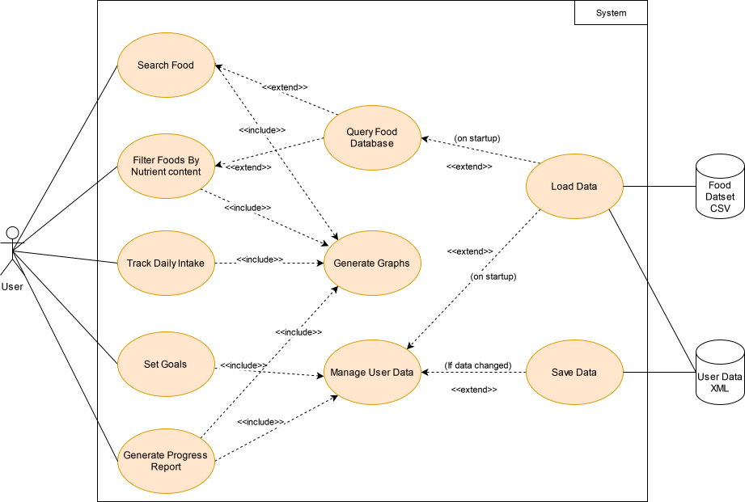
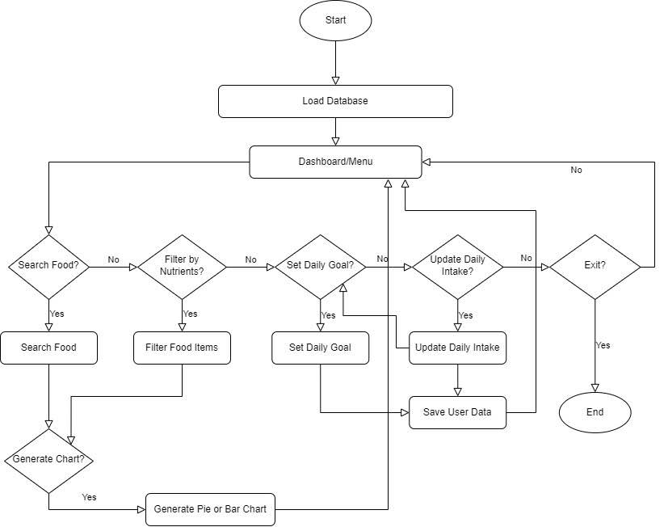
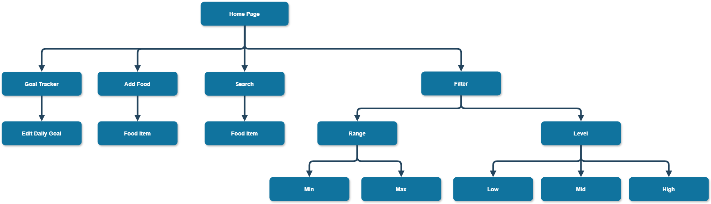
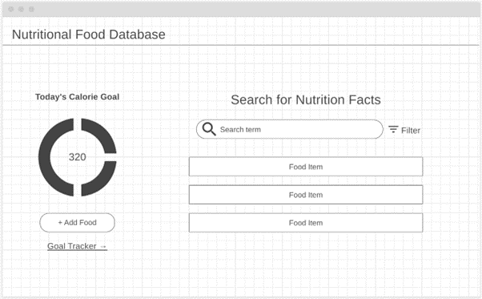
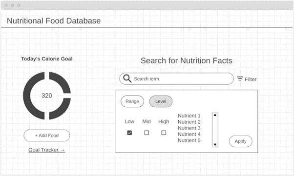
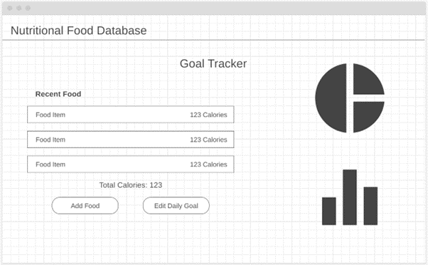
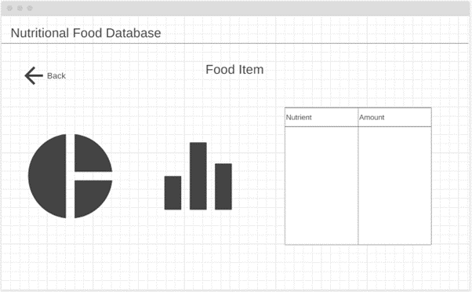

# Software Design Document

## Project Name: Nutrition App Development
## Group Number: 52

## Team members

| Student Number | Name                            | 
|----------------|---------------------------------|
| s5278113       | Jacob Barany                    |
| s5345670       | Glyza Lou Sim                   | 
| s5357200       | Chathumika Dimukthi Wijesinghe  | 


<div style="page-break-after: always;"></div>


# Table of Contents

<!-- TOC -->
* [Table of Contents](#table-of-contents)
  * [1. System Vision](#1-system-vision)
    * [1.1 Problem Background](#11-problem-background)
    * [1.2 System capabilities/overview](#12-system-capabilitiesoverview)
    * [1.3	Potential Benefits](#13potential-benefits)
  * [2. Requirements](#2-requirements)
    * [2.1 User Requirements](#21-user-requirements)
    * [2.2	Software Requirements](#22software-requirements)
    * [2.3 Use Case Diagrams](#23-use-case-diagrams)
    * [2.4 Use Cases](#24-use-cases)
  * [3.	Software Design and System Components](#3-software-design-and-system-components-)
    * [3.1	Software Design](#31software-design)
    * [3.2	System Components](#32system-components)
      * [3.2.1 Functions](#321-functions)
      * [3.2.2 Data Structures / Data Sources](#322-data-structures--data-sources)
      * [3.2.3 Detailed Design](#323-detailed-design)
  * [4. User Interface Design](#4-user-interface-design)
    * [4.1 Structural Design](#41-structural-design)
    * [4.2	Visual Design](#42visual-design)
<!-- TOC -->


<div style="page-break-after: always;"></div>


## 1. System Vision

### 1.1 Problem Background

- Problem Identification: An easy all in one food nutritional database and manager is hard for most people to access, many people dont like the fact that various existing applications require internet connectivity at all times and may worry about their private information being leaked. This system is made to provide user friendly access to food nutrition information without the need for internet access. Many people lack a good way to manage their diet and easily search for a wide range of nutritional information on specific foods, which is specifically important for people with health complications or people who just want to be healthier. These people may need to follow some dietary guidelines, for which this system aims to provide an easy way to track daily caloric/nutritional intake.
- Dataset: The provided **Food_Nutrition_Dataset.csv** database will be used to retrieve food specific nutritional information.
- Data Input/Output: 
  - Data Input: 
    - **Food Search**: Users can input the name of a food item to search for its nutritional information.
    - **Data Filtering**: Users can set advanced filters to search for foods that meet specific nutritional ranges/levels.
    - **Nutrition Tracker**: Users can input their daily intake specifying the food items and quantity (weight or servings) 
    - **Goal Setting**: Users can input/set dietary goals for things such as caloric intake or specific nutritional requirements.
  - Data Output:
    - **Nutritional Information Display**: The GUI will display plain text nutritional information for the searched food item using a table.
    - **Visual Analysis**: The GUI will display pie and bar graphs so users can visually analyze their food's nutrition breakdown.
    - **Filtered Food Lists**: The application will filter multiple food items based on the nutrition level input filters and show them in the GUI.
    - **Progress Tracking**: The application will track the user's intake compared to their goal and provide visual and text feedback on their progress, it will allow them to save the progress into a PDF file or just diplay it on the screen.
- Target Users: 
  - Health conscious people
  - People with dietary requirements 
  - Gym goers or fitness enthusiasts
  - Personal trainers
  - Researchers 
  - Healthcare Professionals (such as dietitians and nutritionists).

### 1.2 System capabilities/overview

- System Functionality
  - Search the database for a specific food item and retrieve the nutritional information.
  - Filter based searching where the database is search for any foods that match a criteria.
  - Generate and display graphs based on the searched food item.
  - Tracks users’ nutrition intake and allows for the setting of nutrition intake goals.
  - Store user related information in an external file to be able to track intake over time for example.
  - Generate user progress reports for daily intake which is compared against the goals, will allow users to select a time period to generate a report for.

- Features and Functionalities
  - Search box and button to allow users to input the name of a food item to get information on.
  - A panel to allow for the enabling and setting of level and range filters.
  - A panel to input the user's daily intake, it will have a row format where they can input or not input certain nutrients.
  - A panel to set the user's daily goal with the same format as the intake tracker.
  - A panel to display pie and bar graphs to the user which will be displayed after they search for a specific item.
  - An option to generate a progress report for a time period there will be inputs for start and end date.

### 1.3	Benefit Analysis

How will this system provide value or benefit?
- Provides motivation for users who use the daily tracking system through the visual graphs and user-friendly UI
- Promotes healthy food habits to keep users on track for their goals
- By having an app that provides quick food search and advanced filtering it helps save time for researching purposes or for calculating personal intake
- Valuable for educational purposes since the app can be used by healthcare professionals and researchers 
- Providing detailed descriptions and numbers on what a food item contains can help users make informed decisions on what they consume 
- The app can cater to a wide variety of people who have health conditions and dietary restrictions which gives the app the competitive edge

## 2. Requirements

### 2.1 User Requirements

This application will provide a simple but powerful GUI for users to interact with the system. Designed for the average non-tech-savvy individual to ensure greater accessibility.

Fictional User: A gym goer who is focused on meeting specific dietary intakes to maintain a healthy diet. This user is fairly knowledgeable on nutrition but needs an easy tool to manage daily food intake, track progress and access nutritional information 

From the user's perspective the application will:
- Allow the searching of specific foods by name and viewing of detailed nutritional information in an easy-to-read format.
- Present nutritional data visually with pie and bar graphs which helps the user understand the nutritional breakdown of different foods.
- Enable advanced filtering/searching options to find foods based on specific nutritional criteria, allowing filtering by range or levels of specific nutrients.
- Provide a daily nutrition/intake tracker to log food intake, track nutritional consumption and monitor progress towards any set goals.
- Allow the user to set and modify daily nutritional goals, showing progress from the tracker.
- The application will automatically save data after updating the tracker or their goals, the user will be able to close and re-open the program without losing any data.

### 2.2	Software Requirements
Define the functionality the software will provide.
- **R1: Data Handling**
  - R1.1 The software shall load the dataset file into memory upon startup.
  - R1.2 The software shall load user data on startup.
  - R1.3 The software shall save user data whenever it is updated.

- **R2: User Interface**
  - R2.1 The software shall employ a graphical user interface to interact with the system.
  - R2.2 The software shall display nutritional data in plain text and using visual aids including pie and bar graphs.
  - R2.3 The software shall display error messages and confirmations.
  - R2.4 The software shall allow the enabling of different filter types in the search panel.
    
- **R3: Data Querying and Filtering**
  - R3.1 The software shall provide search functionality for users to query nutritional information.
  - R3.2 The software shall support data filtering, to query multiple food items that fit a criteria.
    - R3.2.1 Nutritional range filtering, allowing users to specifcy a nutrient and define a min and max.
    - R3.2.2 Nutrition level filtering, categorizing nutrient content into low, mid and high ranges.

- **R4: User Features and Tracking**
  - R4.1 The software shall include a daily nutrition tracker where users can log food items consumed.
  - R4.2 The software shall allow users to set or modify daily nutrition goals.
  - R4.3 The software shall generate and/or display reports on progress towards goals with information from the tracker.
  
- **R5: Error Handling and Logging**
  - R5.1: The software shall appropriately report any errors to the user in a simple manner.
  - R5.2: The software shall log any errors in a more detailed manner to an external file which should provide the developers to identify any bugs
  - R5.3: The software shall log all user interactions and software tasks to trace the error and figure out the problem.


### 2.3 Use Case Diagram
System-level Use Case Diagram illustrating all required features.



### 2.4 Use Cases

| Use Case ID    | 001                                                                                                                                                                                                                                                    |
|----------------|--------------------------------------------------------------------------------------------------------------------------------------------------------------------------------------------------------------------------------------------------------|
| Use Case Name  | Search for Nutritional Information                                                                                                                                                                                                                     |
| Actors         | Users                                                                                                                                                                                                                                               |
| Description    | The user wants to search for a specific food item's nutritional content.                                                                                                                                                                               |
| Flow of Events | 1. The user enters the name of a specific food item in the search bar.<br/>2. The system retrieves the nutritional information from the database.<br/>3. The system displays the nutritional information in text format and associated bar/pie charts. |
| Alternate Flow | 1. The user enters the name of a food item that does not exist in the database.<br/>2. A message is displayed saying "No Results Found".                                                                                                               |

| Use Case ID    | 002                                                                                                                                                                                                                                                                       |
|----------------|---------------------------------------------------------------------------------------------------------------------------------------------------------------------------------------------------------------------------------------------------------------------------|
| Use Case Name  | Filter Food by Nutritional Range                                                                                                                                                                                                                                          |
| Actors         | Users                                                                                                                                                                                                                                                                 |
| Description    | The user wants to search for foods based on the content of a specific nutrient within a range.                                                                                                                                                                            |
| Flow of Events | 1. The user selects a nutrient (e.g. calories) and specifies a min and max amount (grams).<br/>2. The system filters the foods from the database that fall within the range and creates a new list from them.<br/>3. The system displays the filtered list of food items. |
| Alternate Flow | 1. The user selects a nutrient and specifies min and max amount.<br/>2. No foods in the database match the criteria.<br/>3. A message is displayed saying "No Results Found for the Specified Range".                                                                     |

| Use Case ID    | 003                                                                                                                                                                                                                                                                                                                                                                                                                                                                                                                                                                     |
|----------------|-------------------------------------------------------------------------------------------------------------------------------------------------------------------------------------------------------------------------------------------------------------------------------------------------------------------------------------------------------------------------------------------------------------------------------------------------------------------------------------------------------------------------------------------------------------------------|
| Use Case Name  | Track Daily Nutritional Intake                                                                                                                                                                                                                                                                                                                                                                                                                                                                                                                                          |
| Actors         | Users                                                                                                                                                                                                                                                                                                                                                                                                                                                                                                                                                               |
| Description    | The user wants to log their daily food intake to monitor their intake over time.                                                                                                                                                                                                                                                                                                                                                                                                                                                                                        |
| Flow of Events | 1. The user clicks the "Track Intake" button from the menu bar.<br/>2. A form panel is displayed.<br/>3. The user inputs the food items consumed and the associated quantities consumed in grams.<br/>3. The system calculates the nutrient intake by querying the database and getting the nutrient content of the specific food item and processing the specific amount for each nutrient.<br/>4. The daily intake part of the global user data structure is updated with the new total by adding the calculated amounts to the existing amounts for the current day. |
| Alternate Flow | 1. The user clicks the "Track Intake" button from the menu bar.<br/>2. A form panel is displayed.<br/>3. The user enters a food item that does not exist in the database.<br/>4. The user is then shown a message saying "Food Item Not Found, Please Enter Valid Food Name".                                                                                                                                                                                                                                                                                           |

| Use Case ID    | 004                                                                                                                                                                                                                                                                                                                                                                                                                                                                                                                                                                                                                                                                                                         |
|----------------|-------------------------------------------------------------------------------------------------------------------------------------------------------------------------------------------------------------------------------------------------------------------------------------------------------------------------------------------------------------------------------------------------------------------------------------------------------------------------------------------------------------------------------------------------------------------------------------------------------------------------------------------------------------------------------------------------------------|
| Use Case Name  | Set or Update Nutritional Goals                                                                                                                                                                                                                                                                                                                                                                                                                                                                                                                                                                                                                                                                             |
| Actors         | Users                                                                                                                                                                                                                                                                                                                                                                                                                                                                                                                                                                                                                                                                                                   |
| Description    | The user wants to set or update their daily nutrition goals.                                                                                                                                                                                                                                                                                                                                                                                                                                                                                                                                                                                                                                                |
| Flow of Events | 1. The user clicks the "Set/Update Nutrition Goals" tab in the menu bar.<br/>2. A form panel is displayed, the user does not have any previously set goals, the panel shows a table of nutrients each with unpopulated input boxes.<br/>3. The user inputs their desired amounts for any of the nutrients.<br/>4. The user clicks the save button.<br/>5. The goal section in the global user data structure is updated with the inputted goals.                                                                                                                                                                                                                                                            |
| Alternate Flow | 1. The user clicks the "Set/Update Nutrition Goals" tab in the menu bar.<br/>2. A form panel is displayed, the user already has set goals, the panel shows nutrients each with either unpopulated or populated input boxes depending on which have previously been set.<br/>3. The user inputs/overrides their desired amounts for any of the nutrients.<br/>4. The user clicks the save button.<br/>5. The user is prompted with a text box containing Yes/No buttons asking "Do You Wish to Override the Previously Set Goals?"<br/>6. The user clicks yes or no.<br/>7. If yes is clicked, the goal section in the global user data structure is updated with the inputted goals, if no nothing happens. |

| Use Case ID    | 005                                                                                                                                                                                                                                                                                                                                                                                                                                                                                                        |
|----------------|------------------------------------------------------------------------------------------------------------------------------------------------------------------------------------------------------------------------------------------------------------------------------------------------------------------------------------------------------------------------------------------------------------------------------------------------------------------------------------------------------------|
| Use Case Name  | Generate Nutritional Progress Report                                                                                                                                                                                                                                                                                                                                                                                                                                                                       |
| Actors         | Users                                                                                                                                                                                                                                                                                                                                                                                                                                                                                                  |
| Description    | The user wants to generate a nutritional progress report showing their progress towards their set goal over a certain period of time showing each day in the period.                                                                                                                                                                                                                                                                                                                                       |
| Flow of Events | 1. The user selects the "Progress Report" button in the menu bar.<br/>2. The user selects a date range to generate reports for.<br/>3. The system retrieves the user's daily intake data over the selected period along with the goal that was being used at the time.<br/>4. The system compiles the data and generates a detailed report showing how far under or over their goals they went, along with graphs.<br/>5. The user is provided with the option to download the report as a PDF or view it. |
| Alternate Flow | 1. The user selects the "Progress Report" button in the menu bar.<br/>2. The user selects a date range that has no logged data.<br/>3. The system displays a message saying "No Data Logged for the Specified Period".                                                                                                                                                                                                                                                                                     |

## 3.	Software Design and System Components 

### 3.1	Software Design



### 3.2	System Components

#### 3.2.1 Functions
List all key functions within the software.

**load_database()**
- Description: Loads the 'Food_Nutrition_Dataset.csv' database into memory.
- Input Parameters:
  - *db_path: str* - Path to the csv file.
- Return Value:
  - *None*
- Side Effects: Updates the global pandas.DataFrame with data extracted from the CSV file.

**search_food()**
- Description: Searches for food items based on a text query, partial matches are also returned to allow the user to select them in the GUI.
- Input Parameters:
  - *query: str* - Food name.
- Return Value:
  - *matches: pandas.DataFrame* - A dataframe containing rows where the food name partially or completely matched the query, each row represent a food item and the columns are nutrients.
- Side Effects: Updates and opens a list component in the GUI bellow the search box showing partial matches.

**filter_by_range()**
- Description: Filters food items based on a specific nutrient range.
- Input Parameters:
  - *nutrient: str* - The nutrient to filter for.
  - *min: float* - Minimum value of the nutrient.
  - *max: float* - Maximum value of the nutrient.
 - Return Value:
   - *filtered_df: pandas.DataFrame* - A dataframe containing food items that match the nutrient range criteria.
 - Side Effects: None.

**filter_by_level()**
- Description: Filters food items based on nutrient levels (low, mid, high).
- Input Parameters:
  - *nutrient: str* - The nutrient to filter for.
  - *level: str* - The nutrient level, low < 33%, mid > 33% && < 66%, high > 66%.
- Return Value:
  - *filtered_df: pandas.DataFrame* - A dataframe containing food items that match the nutrient level criteria.
- Side Effects: None.

**generate_pie_chart()**
- Description: Generates a dynamically sized pie chart using matplotlib, embedded in a wxPython panel, to visualize a specific food items nutritional breakdown.
- Input Parameters:
  - *food_item: pandas.Series* - A series containing the nutritional data for the food item to be graphed, including nutrient names and quantities.
- Return Value:
  - *None*
- Side Effects: Updates the GUI panel by embedding the chart using the matplotlib figure which is dynamically resized to fit the dimensions.

**generate_bar_chart()**
- Description: Generates a dynamically sized bar chart using matplotlib, embedded in a wxPython panel, to visualize a specific food items nutritional breakdown.
- Input Parameters:
  - *food_item: pandas.Series* - A series containing the nutritional data for the food item to be graphed, including nutrient names and quantities.
- Return Value:
  - *None*
- Side Effects: Updates the GUI panel by embedding the chart using the matplotlib figure which is dynamically resized to fit the dimensions.

**update_daily_intake()**
- Description: Logs and tracks the user's daily food intake.
- Input Parameters:
  - *food_item: pandas.Series* - A series containing the nutritional data for the food item.
  - *quantity: float* - The amount of food consumed in grams.
- Return Value: None.
- Side Effects: Updates the user's daily intake in the global user data structure, which is saved to a file to be persistent across sessions.

**set_daily_goal()**
- Description: Sets the users daily goal.
- Input Parameters:
  - *nutrients: pandas.Series* - A series of nutrient target values stored as floats.
- Return Value: None.
- Side Effects: Updates the user's daily daily in the global user data structure.

**get_goal_progress()**
- Description: Gets the difference between daily intakes and the set goals for various nutrients over a period of time and writes the results to a formatted PDF file.
- Input Parameters:
  - *start_date: str* - YYYY-MM-DD
  - *end_date: str* - YYYY-MM-DD
- Return Value:
  - *None*
- Side Effects: Generates and saves a PDF file containing a report of the user's progress towards the set daily goals for each day in the time period.

**save_user_data()**
- Description: Saves user data (all the user data stored in the global data structure, e.g intake, goals) to a XML file so that user data is persistent across sessions, if the file exists it appends.
- Input Parameters:
  - *file_path: str* - The path where the file is saved.
- Return Value: None.
- Side Effects: Writes user data to a file.

**load_user_data()**
- Description: Loads the user data saved in a XML file (if it exists).
- Input Parameters:
  - *file_path: str* - The path where the file is saved.
- Return Value: None.
- Side Effects: Writes user data to the global user data structure.

#### 3.2.2 Data Structures / Data Sources

### 1. Pandas DataFrame
- **Type:** DataFrame
- **Usage:** Used to hold and manipulate tabular data, such as food nutrition data and search results. The DataFrame is created when loading the CSV file and is used for filtering and generating charts.
- **Functions:**
  - `load_database()`: Updates the global DataFrame with data from the CSV file.
  - `search_food()`: Returns a DataFrame of food items matching the search query.
  - `filter_by_range()`: Returns a DataFrame of food items filtered by a specific nutrient range.
  - `filter_by_level()`: Returns a DataFrame of food items filtered by nutrient levels.
  - `generate_pie_chart()`: Uses a DataFrame (as a pandas Series) to generate a pie chart.
  - `generate_bar_chart()`: Uses a DataFrame (as a pandas Series) to generate a bar chart.

### 2. Global User Data Structure
- **Type:** Dictionary or custom data structure
- **Usage:** Stores user-specific data such as daily intake records, goals, and preferences. This structure is updated throughout the application to reflect the user's interactions and choices.
- **Functions:**
  - `update_daily_intake()`: Updates the daily intake records in the global user data structure.
  - `set_daily_goal()`: Updates the user's daily nutritional goals in the global user data structure.
  - `save_user_data()`: Saves the global user data structure to an XML file.
  - `load_user_data()`: Loads user data from an XML file into the global user data structure.

### 3. XML Files
- **Type:** XML file
- **Usage:** Used for persistent storage of user data, such as daily intake and goals. XML files are read from and written to for saving and loading user data across sessions.
- **Functions:**
  - `save_user_data()`: Writes the global user data structure to an XML file.
  - `load_user_data()`: Reads user data from an XML file and updates the global user data structure.

### 4. Matplotlib Figures
- **Type:** Figure (from Matplotlib)
- **Usage:** Used for generating and displaying charts (pie and bar charts) embedded in the GUI.
- **Functions:**
  - `generate_pie_chart()`: Creates a pie chart using a Matplotlib figure.
  - `generate_bar_chart()`: Creates a bar chart using a Matplotlib figure.
=======
1. **Pandas DataFrame**
   - **Type**: DataFrame
   - **Usage**: Used to hold and manipulate tabular data, such as food nutrition data and search results. The DataFrame is created when loading the CSV file and is used for filtering and generating charts.
   - **Functions**:
     - `load_database()`: Updates the global DataFrame with data from the CSV file.
     - `search_food()`: Returns a DataFrame of food items matching the search query.
     - `filter_by_range()`: Returns a DataFrame of food items filtered by a specific nutrient range.
     - `filter_by_level()`: Returns a DataFrame of food items filtered by nutrient levels.
     - `generate_pie_chart()`: Uses a DataFrame (as a pandas Series) to generate a pie chart.
     - `generate_bar_chart()`: Uses a DataFrame (as a pandas Series) to generate a bar chart.

2. **Global User Data Structure**
   - **Type**: Dictionary or custom data structure
   - **Usage**: Stores user-specific data such as daily intake records, goals, and preferences. This structure is updated throughout the application to reflect the user's interactions and choices.
   - **Functions**:
     - `update_daily_intake()`: Updates the daily intake records in the global user data structure.
     - `set_daily_goal()`: Updates the user's daily nutritional goals in the global user data structure.
     - `save_user_data()`: Saves the global user data structure to an XML file.
     - `load_user_data()`: Loads user data from an XML file into the global user data structure.

3. **XML Files**
   - **Type**: XML file
   - **Usage**: Used for persistent storage of user data, such as daily intake and goals. XML files are read from and written to for saving and loading user data across sessions.
   - **Functions**:
     - `save_user_data()`: Writes the global user data structure to an XML file.
     - `load_user_data()`: Reads user data from an XML file and updates the global user data structure.

4. **Matplotlib Figures**
   - **Type**: Figure (from Matplotlib)
   - **Usage**: Used for generating and displaying charts (pie and bar charts) embedded in the GUI.
   - **Functions**:
     - `generate_pie_chart()`: Creates a pie chart using a Matplotlib figure.
     - `generate_bar_chart()`: Creates a bar chart using a Matplotlib figure.

#### 3.2.3 Detailed Design

1. **load_database()**
   - **Description**: Loads the `Food_Nutrition_Dataset.csv` file into a pandas DataFrame for further use in searching and filtering.
   - **Pseudocode**:
     ```python
     def load_database(db_path: str) -> None:
         global database_df
         database_df = pandas.read_csv(db_path)  # Load CSV into DataFrame
     ```

2. **search_food()**
   - **Description**: Searches for food items based on a partial or full match of the food name and returns the matching rows.
   - **Pseudocode**:
     ```python
     def search_food(query: str) -> pandas.DataFrame:
         matches = database_df[database_df['food'].str.contains(query, case=False)]  # Case-insensitive search
         return matches  # Return filtered DataFrame
     ```

3. **filter_by_range()**
   - **Description**: Filters the food items based on a specified nutrient range.
   - **Pseudocode**:
     ```python
     def filter_by_range(nutrient: str, min_val: float, max_val: float) -> pandas.DataFrame:
         filtered_df = database_df[(database_df[nutrient] >= min_val) & (database_df[nutrient] <= max_val)]
         return filtered_df
     ```

4. **filter_by_level()**
   - **Description**: Filters food items based on nutrient levels (low, mid, high).
   - **Pseudocode**:
     ```python
     def filter_by_level(nutrient: str, level: str) -> pandas.DataFrame:
         if level == 'low':
             filtered_df = database_df[database_df[nutrient] < 33]
         elif level == 'mid':
             filtered_df = database_df[(database_df[nutrient] >= 33) & (database_df[nutrient] <= 66)]
         elif level == 'high':
             filtered_df = database_df[database_df[nutrient] > 66]
         return filtered_df
     ```

5. **generate_pie_chart()**
   - **Description**: Generates a pie chart using Matplotlib to show the nutritional breakdown of a food item.
   - **Pseudocode**:
     ```python
     def generate_pie_chart(food_item: pandas.Series) -> None:
         # Extract nutrient data from the food_item series
         nutrients = food_item.drop(['food'])  # Drop the 'food' column to focus on nutrients
         nutrients.plot.pie(autopct='%1.1f%%')  # Generate pie chart
         plt.show()  # Display chart
     ```

6. **generate_bar_chart()**
   - **Description**: Generates a bar chart using Matplotlib to show the nutritional breakdown of a food item.
   - **Pseudocode**:
     ```python
     def generate_bar_chart(food_item: pandas.Series) -> None:
         nutrients = food_item.drop(['food'])  # Drop the 'food' column
         nutrients.plot.bar()  # Generate bar chart
         plt.show()  # Display chart
     ```

7. **update_daily_intake()**
   - **Description**: Logs the user's daily intake of a food item by adding the consumed quantity to the user's total intake.
   - **Pseudocode**:
     ```python
     def update_daily_intake(food_item: pandas.Series, quantity: float) -> None:
         global daily_intake
         for nutrient in food_item.index:
             daily_intake[nutrient] += food_item[nutrient] * (quantity / 100)  # Add nutrient value to intake
     ```

8. **set_daily_goal()**
   - **Description**: Sets the user's daily nutrient goals based on the input provided.
   - **Pseudocode**:
     ```python
     def set_daily_goal(nutrients: pandas.Series) -> None:
         global daily_goal
         daily_goal = nutrients.to_dict()  # Convert Series to dictionary
     ```

9. **get_goal_progress()**
   - **Description**: Compares the user's daily intake to their goals and generates a progress report.
   - **Pseudocode**:
     ```python
     def get_goal_progress(start_date: str, end_date: str) -> None:
         # Logic to calculate progress between daily intake and goals over a date range
         progress_report = generate_progress_report(start_date, end_date)
         save_to_pdf(progress_report)
     ```

10. **save_user_data()**
    - **Description**: Saves user data (daily intake, goals, etc.) to an XML file to ensure persistence across sessions.
    - **Pseudocode**:
      ```python
      def save_user_data(file_path: str) -> None:
        user_data.to_xml(file_path, index=False)  # Convert DataFrame to XML and save
      ```

11. **load_user_data()**
    - **Description**: Loads the user data from an XML file if it exists.
    - **Pseudocode**:
      ```python
      def load_user_data(file_path: str) -> None:
         global user_data
         user_data = pandas.read_xml(file_path)  # Load XML into DataFrame
      ```


## 4. User Interface Design

### 4.1 Structural Design
Present a structural design, a hierarchy chart, showing the overall interface’s structure.

Structure
- Information Grouping
  - The information would be split into two main sections: the daily tracker and the main food search.
  - Within the daily tracker it would contain all the needed actions for the user to input the food they ate throughout the day and would display that information through graphs and lists of what they have inputted.
  - Within the main food search the home page would have the first input of what food item the user wants to look at. They can also use a filter button to find what meets their requirements. Once they select the food item it would take them to a separate page where they can view all the details through a pie chart or bar graph, so they know exactly what they’re consuming.


- Navigation
  - Main form of navigation would be through clear and distinct buttons on the home page


- Design Choices
  - Straight forward – search bar is the focus of the web app 
  - All information the user needs is presented to them on one page 
  - Less clutter – the use of visuals 
  - Layout is clear and follow web design standards





### 4.2	Visual Design

Screen 1: Home Page

This is the landing page of the web app. The search bar and goal tracker graph are the only main elements that are taking up the space. When a user types in a food item, those items will be displayed right below the search bar. the filter button is also placed beside the search bar for ease of use and to make users aware of the feature since it is a large database and can be difficult to find what you need. another main element when looking at the home page before any user input, the goal tracker is underlined. This indicates that it is a link, making it clear to the users that there are additional features.




Screen 2: Range Filter

When clicking the filter button, a small window overlays the search results which follows the web design standards. Users are used to having filter menus displayed on the side of the screen or as an overlay where the filter button is placed. The use of rounded buttons for actions is consistent throughout the web app to ensure users understand and can see all the available features important to them. 


Screen 3: Level Filter

Both the level and range filters are designed the same way, having the list of nutrients on the right and the toggles/ inputs on the left with the apply button bottom right. This ensures that the users do not get confused with any sudden layout changes which boosts overall user experience. It is also noticeable that when a user is in the level filter, the button turns a darker shade to also indicate to the user that they are in that section. 



Screen 4: Goal Tracker

This goal tracker is our additional feature to the web app. It is an intuitive design that displays a food history along with supporting graphs based on the food. The only user input are the 2 rounded buttons which is consistent within the whole app, allowing for ease of use and utilising the visualisations used in other parts of the app.



Screen 5: Nutrition Information

This is the interface where all nutrition information will be displayed through a pie chart and bar graph. The purpose of the table is to allow users to see a clear list of nutrients as an alternative to the visual aid. This caters to anyone who is looking for specific items within that list or just prefer plain text. The back arrow button is large, clear and bold to ensure all users are able to go back to the search results.



