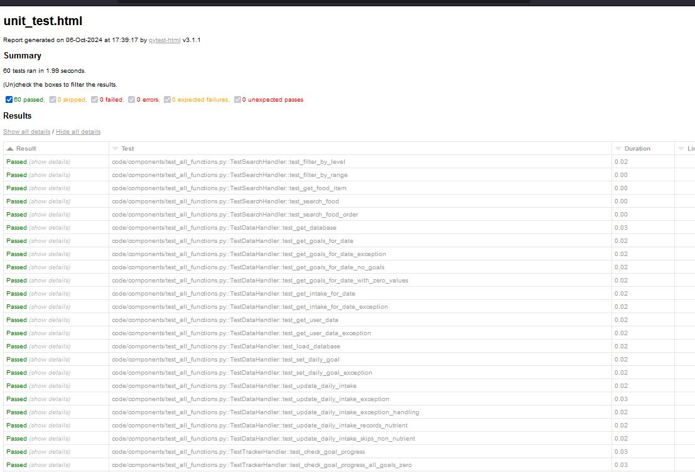
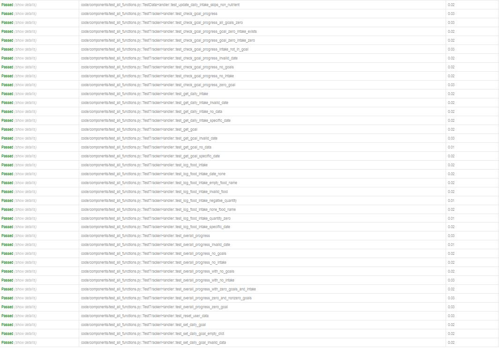

# Unit Testing Report

Please provide your GitHub repository link.
### GitHub Repository URL: https://github.com/Altidias/Milestone1_Group52

---


## 1. **Test Summary**

| **Tested Functions** | **Test Functions** |
|----------------------|---------------------|
| `SearchHandler.search_food()` | `test_search_food()` <br> `test_search_food_order()` |
| `SearchHandler.filter_by_range()` | `test_filter_by_range()` |
| `SearchHandler.filter_by_level()` | `test_filter_by_level()` |
| `SearchHandler.get_food_item()` | `test_get_food_item()` |
| `DataHandler.load_database()` | `test_load_database()` |
| `DataHandler.update_daily_intake()` | `test_update_daily_intake()` <br> `test_update_daily_intake_skips_non_nutrient()` <br> `test_update_daily_intake_records_nutrient()` <br> `test_update_daily_intake_exception_handling()` <br> `test_update_daily_intake_exception()` |
| `DataHandler.set_daily_goal()` | `test_set_daily_goal()` <br> `test_set_daily_goal_exception()` |
| `DataHandler.get_database()` | `test_get_database()` |
| `DataHandler.get_user_data()` | `test_get_user_data()` <br> `test_get_user_data_exception()` |
| `DataHandler.get_goals_for_date()` | `test_get_goals_for_date()` <br> `test_get_goals_for_date_exception()` <br> `test_get_goals_for_date_with_zero_values()` <br> `test_get_goals_for_date_no_goals()` |
| `DataHandler.get_intake_for_date()` | `test_get_intake_for_date()` <br> `test_get_intake_for_date_exception()` |
| `TrackerHandler.set_daily_goal()` | `test_set_daily_goal()` <br> `test_set_daily_goal_invalid_data()` <br> `test_set_daily_goal_empty_dict()` |
| `TrackerHandler.log_food_intake()` | `test_log_food_intake()` <br> `test_log_food_intake_invalid_food()` <br> `test_log_food_intake_date_none()` <br> `test_log_food_intake_specific_date()` <br> `test_log_food_intake_quantity_zero()` <br> `test_log_food_intake_negative_quantity()` <br> `test_log_food_intake_none_food_name()` <br> `test_log_food_intake_empty_food_name()` |
| `TrackerHandler.check_goal_progress()` | `test_check_goal_progress()` <br> `test_check_goal_progress_no_intake()` <br> `test_check_goal_progress_no_goals()` <br> `test_check_goal_progress_zero_goal()` <br> `test_check_goal_progress_goal_zero_intake_zero()` <br> `test_check_goal_progress_goal_zero_intake_exists()` <br> `test_check_goal_progress_intake_not_in_goal()` <br> `test_check_goal_progress_all_goals_zero()` <br> `test_check_goal_progress_invalid_date()` |
| `TrackerHandler.overall_progress()` | `test_overall_progress()` <br> `test_overall_progress_no_goals()` <br> `test_overall_progress_no_intake()` <br> `test_overall_progress_zero_goal()` <br> `test_overall_progress_zero_and_nonzero_goals()` <br> `test_overall_progress_with_no_goals()` <br> `test_overall_progress_with_no_intake()` <br> `test_overall_progress_with_zero_goals_and_intake()` <br> `test_overall_progress_invalid_date()` |
| `TrackerHandler.get_daily_intake()` | `test_get_daily_intake()` <br> `test_get_daily_intake_no_data()` <br> `test_get_daily_intake_specific_date()` <br> `test_get_daily_intake_invalid_date()` |
| `TrackerHandler.get_goal()` | `test_get_goal()` <br> `test_get_goal_no_data()` <br> `test_get_goal_specific_date()` <br> `test_get_goal_invalid_date()` |
| `DataHandler.reset_user_data()` | `test_reset_user_data()` |

---

## 2. **Test Case Details**

### Test Case 1: SearchHandler.search_food()
- **Test Function/Module**
  - `test_search_food()`
  - `test_search_food_order()`
- **Tested Function/Module**
  - `SearchHandler.search_food(query)`
- **Description**
  - This function searches for food items in the database based on a given query. It returns a DataFrame of matching food items.
- **1) Valid Input and Expected Output**  

| **Valid Input**               | **Expected Output** |
|-------------------------------|---------------------|
| `search_food("app")`          | DataFrame containing 'apple' |
| `search_food("")`             | Full database DataFrame |
| `search_food("qwertyuiop")`   | Empty DataFrame |

- **1) Code for the Test Function**
```python
def test_search_food(self):
    results = self.search_handler.search_food("app")
    self.assertFalse(results.empty)
    self.assertIn('apple', results['food'].str.lower().tolist())

def test_search_food_order(self):
    results = self.search_handler.search_food("app")
    self.assertFalse(results.empty)
    query = "app"
    similarities = []
    for name in results['food']:
        similarity = SequenceMatcher(None, query, name.lower()).ratio()
        similarities.append(similarity)
    self.assertEqual(similarities, sorted(similarities, reverse=True))

    empty_results = self.search_handler.search_food("qwertyuiop")
    self.assertTrue(empty_results.empty)

    all_results = self.search_handler.search_food("")
    self.assertFalse(all_results.empty)
    self.assertEqual(len(all_results), len(self.search_handler.database_df))
```

### Test Case 2: DataHandler.update_daily_intake()
- **Test Function/Module**
  - `test_update_daily_intake()`
  - `test_update_daily_intake_skips_non_nutrient()`
- **Tested Function/Module**
  - `DataHandler.update_daily_intake(nutrients, servings, date)`
- **Description**
  - This function updates the user's daily intake of nutrients for a specific date.
- **1) Valid Input and Expected Output**  

| **Valid Input**               | **Expected Output** |
|-------------------------------|---------------------|
| `update_daily_intake({'Caloric Value': 52, 'Protein': 0.3}, 2, '2023-05-20')` | Daily intake updated with 104 calories and 0.6g protein |
| `update_daily_intake({'food': 'apple', 'Nutrition Density': 10}, 1, '2023-05-20')` | No change in daily intake (non-nutrient keys skipped) |

- **1) Code for the Test Function**
```python
def test_update_daily_intake(self):
    nutrients = {'Caloric Value': 52, 'Protein': 0.3}
    today = datetime.now().strftime('%Y-%m-%d')
    self.data_handler.update_daily_intake(nutrients, 2, today)
    retrieved_intake = self.data_handler.get_intake_for_date(today)
    self.assertAlmostEqual(retrieved_intake['Caloric Value'], 104)
    self.assertAlmostEqual(retrieved_intake['Protein'], 0.6)

def test_update_daily_intake_skips_non_nutrient(self):
    nutrients = {'food': 'apple', 'Nutrition Density': 10}
    today = datetime.now().strftime('%Y-%m-%d')
    self.data_handler.update_daily_intake(nutrients, 1, today)
    intake = self.data_handler.get_intake_for_date(today)
    self.assertEqual(intake, {}, "Intake should be empty as non-nutrient keys are skipped.")
```

### Test Case 3: TrackerHandler.log_food_intake()
- **Test Function/Module**
  - `test_log_food_intake()`
  - `test_log_food_intake_invalid_food()`
- **Tested Function/Module**
  - `TrackerHandler.log_food_intake(food_name, servings, date)`
- **Description**
  - This function logs the intake of a specific food item, updating the daily intake of nutrients.
- **1) Valid Input and Expected Output**  

| **Valid Input**               | **Expected Output** |
|-------------------------------|---------------------|
| `log_food_intake('apple', 2)` | Daily intake updated with nutrients from 2 servings of apple |
| `log_food_intake('nonexistent food', 1)` | ValueError raised |

- **1) Code for the Test Function**
```python
def test_log_food_intake(self):
    today = datetime.now().strftime('%Y-%m-%d')
    self.tracker_handler.log_food_intake('apple', 2, today)
    daily_intake = self.tracker_handler.get_daily_intake(today)
    expected_intake = {'Caloric Value': 104, 'Protein': 0.6, 'Carbohydrates': 28, 'Fat': 0.4}
    for nutrient, value in expected_intake.items():
        self.assertAlmostEqual(daily_intake.get(nutrient, 0), value)

def test_log_food_intake_invalid_food(self):
    with self.assertRaises(ValueError):
        self.tracker_handler.log_food_intake('nonexistent food', 1)
```

### Test Case 4: TrackerHandler.check_goal_progress()
- **Test Function/Module**
  - `test_check_goal_progress()`
  - `test_check_goal_progress_no_intake()`
- **Tested Function/Module**
  - `TrackerHandler.check_goal_progress(date)`
- **Description**
  - This function calculates the progress towards daily nutrient goals based on the current intake.
- **1) Valid Input and Expected Output**  

| **Valid Input**               | **Expected Output** |
|-------------------------------|---------------------|
| `check_goal_progress()` (with goals and intake set) | Dictionary with progress percentages for each nutrient |
| `check_goal_progress()` (with goals set but no intake) | Dictionary with 0% progress for each nutrient |

- **1) Code for the Test Function**
```python
def test_check_goal_progress(self):
    today = datetime.now().strftime('%Y-%m-%d')
    self.tracker_handler.set_daily_goal({'Caloric Value': 2000.0, 'Protein': 50.0})
    self.tracker_handler.log_food_intake('apple', 2, today)
    progress = self.tracker_handler.check_goal_progress(today)
    expected_progress = {
        'Caloric Value': 104 / 2000.0,
        'Protein': 0.6 / 50.0
    }
    for nutrient, value in expected_progress.items():
        self.assertAlmostEqual(progress.get(nutrient, 0), value)

def test_check_goal_progress_no_intake(self):
    self.tracker_handler.set_daily_goal({'Caloric Value': 2000.0})
    progress = self.tracker_handler.check_goal_progress()
    self.assertEqual(progress, {'Caloric Value': 0})
```

### Test Case 5: SearchHandler.filter_by_range()
- **Test Function/Module**
  - `test_filter_by_range()`
- **Tested Function/Module**
  - `SearchHandler.filter_by_range(nutrient, min_val, max_val)`
- **Description**
  - This function filters the food database to return items within a specified range for a given nutrient.
- **1) Valid Input and Expected Output**  

| **Valid Input**               | **Expected Output** |
|-------------------------------|---------------------|
| `filter_by_range("Caloric Value", 50, 100)` | DataFrame with foods having 50-100 calories |

- **1) Code for the Test Function**
```python
def test_filter_by_range(self):
    results = self.search_handler.filter_by_range("Caloric Value", 50, 100)
    self.assertFalse(results.empty)
    self.assertTrue(all((results['Caloric Value'] >= 50) & (results['Caloric Value'] <= 100)))
```

## 3. **Testing Report Summary**


